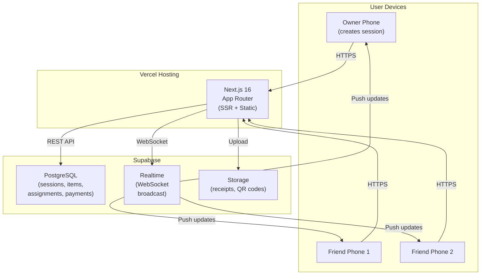
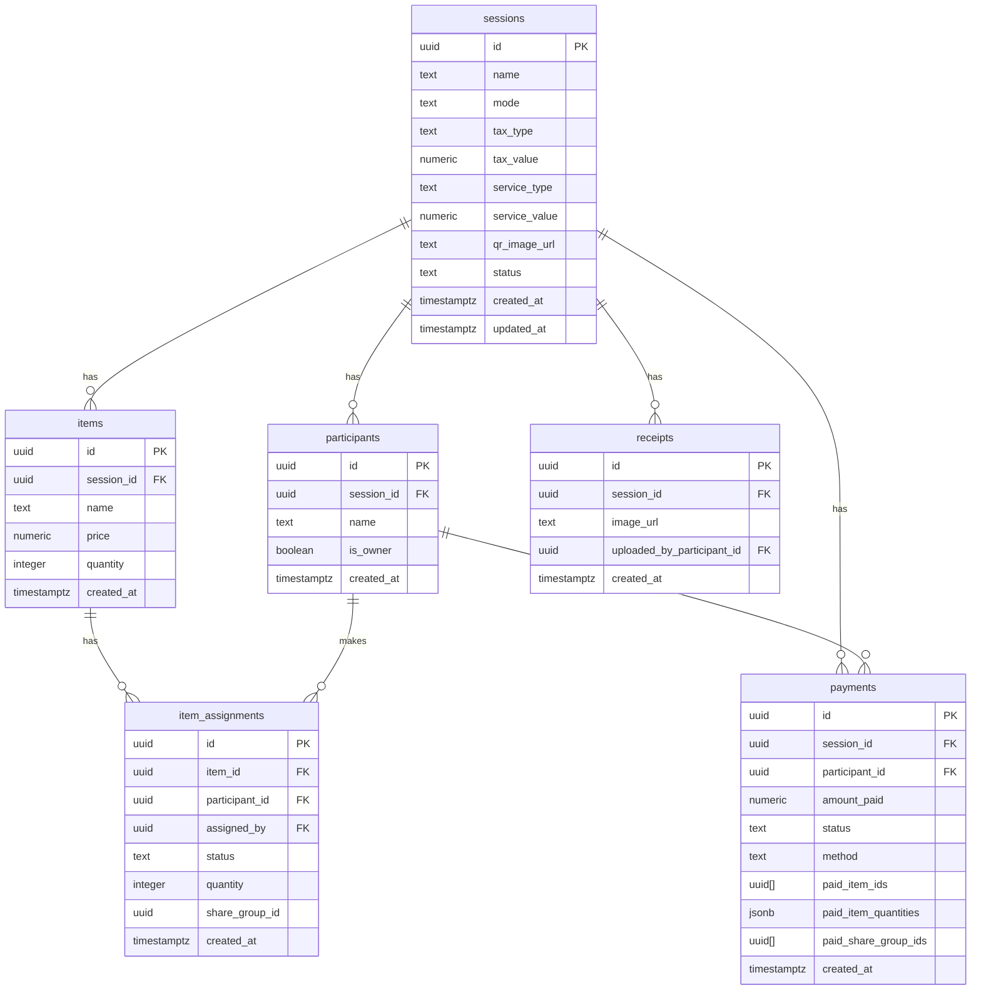
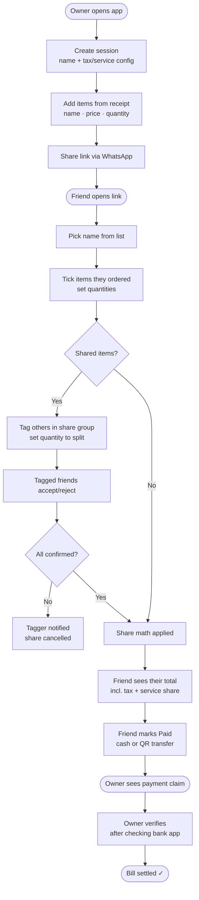
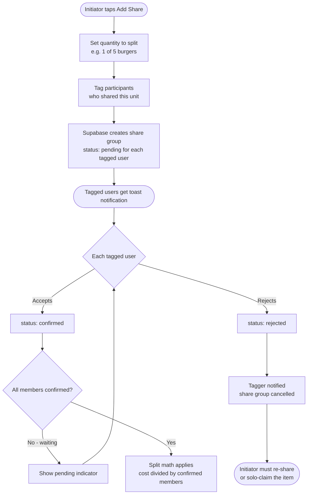

# Splitto — Split Bills, No Drama

> Split bills with friends fairly. No login, no install, just share a link.

---

## 🔗 Quick Links

| | |
|---|---|
| **Live Demo** | https://expense-splitter-three-blush.vercel.app/ |
| **GitHub** | https://github.com/adammianhe/expense-splitter |
| **Demo Video** | [YOUTUBE_LINK_PLACEHOLDER] |
| **Challenge** | Shortcut Asia Internship Challenge 2026 |
| **Submission Date** | 2 June 2026 |

---

## 📸 Preview


---

## 🧩 The Problem

Splitting bills after a meal with friends sounds simple until it isn't. People order different things, some share dishes, quantities vary, and someone always forgets to pay. Most bill splitter apps default to equal splits — which is unfair when one person had a RM 8 nasi lemak and another had a RM 35 steak. And the apps that do handle item-by-item splitting almost always require a sign-up, which nobody wants to do just to settle a one-time meal.

---

## 💡 The Solution

Splitto is a no-login Progressive Web App built for exactly this scenario. An owner creates a session, adds items from the receipt, and shares a link. Friends open the link, tap their name, tick what they ordered, and the app handles the math — tax, service charge, and all.

**How it works:**
- Owner creates session → adds items with quantities and price
- Shares link (WhatsApp, etc.) with friends
- Friends join → tap their name → tick what they had
- App calculates each person's proportional share (including tax/service)
- Friends mark paid → owner verifies the transfer
- Everyone's settled, no drama

---

## ⚡ Key Features

| # | Feature | Description |
|---|---------|-------------|
| 1 | **No-Login Architecture** | Secure random session UUIDs + localStorage device memory. The URL is the access token. No accounts needed. |
| 2 | **Quantity-Aware Items** | Items have quantities (e.g. 5 burgers × RM 8). Each/Total price toggle auto-calculates the other to match your receipt format. |
| 3 | **Dual Claim System** | Solo claims (`[− N +]` counter for "I had this many") + share groups (tag people to split one unit with you). |
| 4 | **Share Workflow with Confirmation** | Tagged people must accept/reject a share. Math only applies when all members confirm. Real-time toast notifications. |
| 5 | **Multi-Round Delta Payments** | Track paid quantity per item. Order more food later → pay only the delta, not the whole bill again. |
| 6 | **Asymmetric Locking Rule** | Non-owner paid + fully claimed = locked from new tickers. Owner's confirmed items stay unlocked (owner overpay = no real loss). |
| 7 | **Real-Time WebSocket Sync** | All participants see updates instantly via Supabase Realtime: items, ticks, shares, payments, receipts. |
| 8 | **Receipt Transparency** | Owner uploads receipt photos. Friends can cross-check prices against what was entered. |
| 9 | **Owner Verification Flow** | Friends mark "I've Paid", owner verifies after seeing the bank transfer. Trust, but verify. |
| 10 | **PWA Installable** | Add to home screen. Runs standalone like a native app. Works on iOS and Android. |

---

## 🛠️ Tech Stack

| Layer | Technology |
|-------|-----------|
| **Framework** | Next.js 16 (App Router) |
| **Language** | TypeScript |
| **Styling** | Tailwind CSS |
| **Backend / DB** | Supabase (PostgreSQL + Realtime + Storage) |
| **Icons** | lucide-react |
| **PWA** | next-pwa with service worker |
| **Hosting** | Vercel (Hobby tier) |
| **Fonts** | SF Pro (iOS system) + Inter (Android/Windows via Google Fonts) |

---

## 🏗️ Architecture Overview



---

## 🗄️ Database Schema



---

## 🔄 User Flow



---

## 🤝 Share Workflow



---

## 🧠 Technical Decisions

### 1. Why Next.js?
File-based routing fits the simple page structure (homepage → create → `session/[id]`). App Router supports server components for fast initial loads, and Vercel deployment is seamless.

### 2. Why Supabase?
Real-time subscriptions are essential for live bill updates across multiple phones — Supabase provides this out of the box via PostgreSQL NOTIFY + WebSocket. PostgreSQL gives proper constraints and relational integrity that Firebase's NoSQL can't match. Storage for QR codes and receipts is included. Generous free tier.

### 3. Why No Login?
For a one-meal session, login is friction. Friends shouldn't need accounts to join a bill. Solution: cryptographically random session UUIDs + localStorage device memory. The URL itself becomes the access token. If you have the link, you're in.

### 4. Why Asymmetric Locking Rules?
Owner overpay means he's recovering his own money — no real loss. Friend overpay creates a refund mess (need to track and return money). The app reflects this: owner's confirmed items don't lock for additional tickers, but a non-owner's paid items do. Product decision, not just a code decision.

### 5. Why Multi-Round Delta Payments?
Real life: people order more food mid-meal. Most splitters make you recreate the entire bill. Splitto stores `paid_item_quantities` as JSONB — it knows exactly what's been paid per item and charges only the delta on the next payment.

### 6. Why Database-Level Constraints?
Last line of defense if the app has bugs. Check constraints (`price >= 0`, `quantity > 0`), conditional unique indexes (one solo claim per person per item, multiple shares allowed). Bad data gets rejected at the DB level even if the frontend has a bug.

### 7. Why the Each/Total Price Toggle?
Receipts come in two formats: "RM 5 each × 5 = RM 25" or "Total: RM 25 (qty 5)". Forcing the owner to do mental math to convert formats is bad UX. The toggle matches whatever format the receipt shows and auto-calculates the other field.

### 8. Why Share Groups with Confirm/Reject?
Auto-splitting anyone who ticks an item works for 90% of cases. But for explicit splits ("we three split this one burger"), you need explicit intent — and explicit confirmation. Tagged people must accept or reject. Once all confirm, the math applies. Matches real-world social dynamics.

---

## 🔥 Edge Cases & Challenges

### 1. Quantity-Based Bill Math with Shares
Original design: binary yes/no item ticking. Real users needed quantities. Added `quantity` to both `items` and `item_assignments`. Bill math became: `(solo_qty × unit_price) + sum(confirmed_share_portions) + proportional_tax`. Solved with `useMemo` and per-participant helper functions.

### 2. Multi-Round Payment Tracking
First version: tracked "did this person pay for this item" (boolean). Problem: what if someone paid for 2 of 5 burgers and wants to add another? Refactored to `paid_item_quantities` JSONB — stores `{ item_id: qty_paid }`. Bill now shows delta (new unpaid quantity × unit price) rather than recalculating the whole bill.

### 3. iOS Safari Input Rendering
iOS dark mode caused white-on-white text in inputs. Fixed with explicit `text-gray-900 bg-white` Tailwind classes + global CSS overrides. Set `font-size: 16px` on all inputs to prevent iOS zoom-on-focus.

### 4. PWA on Next.js 16
`next-pwa` expects webpack. Next.js 16 defaults to Turbopack. Build failed with a cryptic service worker error. Fix: added `--webpack` flag to the build script. Dev still uses Turbopack for hot reload speed.

### 5. Asymmetric Locking Edge Cases
Started simple: "if paid, lock for everyone." Then discovered: owner locked from his own confirmed items broke flows. Then discovered: fully-claimed items shouldn't lock if there's still quantity remaining. Final rule: "lock only if a non-owner paid AND the item is fully claimed." Required understanding the product logic, not just the code.

---

## 🚀 Local Development Setup

### Prerequisites
- Node.js 18+
- npm
- Supabase account (free tier works)

### Setup

```bash
# 1. Clone the repo
git clone https://github.com/adammianhe/expense-splitter.git
cd expense-splitter

# 2. Install dependencies
npm install
```

Create `.env.local` in the project root:

```env
NEXT_PUBLIC_SUPABASE_URL=your_supabase_project_url
NEXT_PUBLIC_SUPABASE_ANON_KEY=your_supabase_anon_key
```

```bash
# 3. Run SQL migrations
#    Open your Supabase project → SQL Editor
#    Run the migration files from /supabase/migrations/ in order

# 4. Start development server (Turbopack)
npm run dev

# Production build (webpack — required for PWA)
npm run build
```

Open [http://localhost:3000](http://localhost:3000).

---

## 📁 Project Structure

```
expense-splitter/
├── app/
│   ├── page.tsx              # Homepage
│   ├── create/
│   │   └── page.tsx          # Create session flow
│   └── session/
│       └── [id]/
│           └── page.tsx      # Main session view (real-time)
├── components/
│   ├── ui/                   # Reusable UI primitives
│   ├── session/              # Session-specific components
│   └── create/               # Create flow components
├── hooks/
│   └── useSession.ts         # Session state + Supabase subscriptions
├── lib/
│   ├── supabase.ts           # Supabase client
│   └── calculations.ts       # Bill math helpers
├── types/
│   └── index.ts              # TypeScript types for DB schema
├── public/
│   ├── manifest.json         # PWA manifest
│   └── icons/                # PWA icons
├── next.config.ts
└── package.json
```

---

## 🔮 Future Improvements

- **Rounding adjustment** — receipts often round to nearest 5 sen; add explicit rounding field
- **Equal split mode** — toggle at session creation for simple cases (cut for MVP)
- **Currency selector** — currently hardcoded RM; should support SGD, IDR, etc.
- **Session history** — list past sessions per device (data already in localStorage)
- **OCR receipt scanning** — auto-extract items from receipt photo
- **"Unclaimed items" flag** — explicit handling for items nobody ticked
- **Native app** — wrap PWA in Capacitor for App Store / Play Store distribution

---

## 🙏 Acknowledgments

Built for the **Shortcut Asia Internship Challenge 2026**. The expense splitter topic was one of the suggested challenges — it resonated immediately because I've been the person doing mental math at the mamak table one too many times.

Thanks to the Supabase team for Realtime subscriptions that made live sync possible without a custom WebSocket server, and to the Next.js team for App Router.
